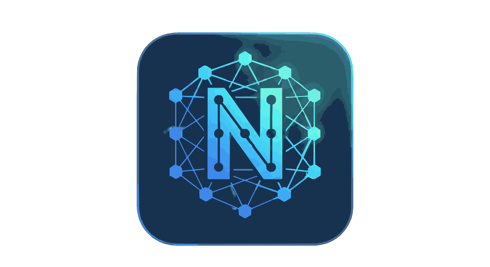

[](https://nodejs.org/)
[](https://vitejs.dev/)
[](https://react.dev/)
[](https://www.typescriptlang.org/)
[](https://tiptap.dev/)
[](https://yjs.dev/)

<h1 align="center">
  
  <br />
  Nodepad
</h1>

Nodepad is a collaborative text editor built on a Hybrid Peer-to-Peer architecture using Y.js. It leverages both WebRTC and WebSockets to ensure real-time synchronization is fast, efficient, and reliable across any network.

---

## Tech Stack

- [Y.js](https://github.com/yjs/yjs) – CRDT-based shared document model
- [y-webrtc](https://github.com/yjs/y-webrtc) – WebRTC-based peer-to-peer provider for y.js
- [y-indexeddb](https://github.com/yjs/y-indexeddb) - Database adapter for offline persistence (see the [persistence guide](/docs/persistency.md))
- [y-websocket](https://github.com/yjs/y-websocket) - WebSocket provider for server-relayed syncing and persistence.
- [Tiptap](https://tiptap.dev/) – Headless, framework-agnostic rich-text editor built on ProseMirror
- [React](https://react.dev/) – Component-based UI library
- [Vite](https://vitejs.dev/) – Fast development bundler and dev server
- [Node.js](https://nodejs.org/) – JavaScript runtime

---

## Prerequisites

- Node.js (LTS recommended)
- npm or yarn
- Modern browser with WebRTC support

---

## Architecture

Nodepad uses Y.js for conflict-free collaborative editing. To maximize reliability, the application employs a Hybrid Sync Strategy:

  1. Peer-to-Peer (Primary): Clients attempt to connect directly via y-webrtc. This offloads traffic from the server and offers low-latency syncing on local networks.

  2. Client-Server (Fallback & Persistence): All clients also connect to a central Node.js server via y-websocket. This ensures that users behind restrictive firewalls (Symmetric NAT) can still collaborate and serves as the central storage for document history.

The server acts as both a Signaling Server (introducing peers for WebRTC) and a Sync Server (relaying data when P2P fails).

---

## Functionalities
- Hybrid Synchronization: Seamlessly merges updates from P2P and WebSocket sources.
- Resilient Connectivity: Works even if P2P connections are blocked by corporate/university firewalls.
- Real-time Collaboration: Multiple users can edit the same document simultaneously.
- Offline Support: Changes are saved locally using IndexedDB and synced when the connection is restored.

---

## Getting Started

### 1. Install Dependencies
This installs all dependencies needed.

```bash
npm install
# or
yarn install
```
### 2. Start the Server

Start the hybrid signaling and sync server.

```bash
npm run server
# or
yarn server
```

*By default, the server runs on port 4444.*

#### 2.1 Server Configuration
Create a ```.env``` file in the project root to configure the connection domain.

```.env
VITE_SIGNALING_SERVER_DOMAIN=wss://<domain>
```
If you for example use a signaling server on your current device on port 4444 - which is default when using ```npm run server``` - you add:

```.env
VITE_SIGNALING_SERVER_DOMAIN=ws://localhost:4444
```
Since we use Vite, the domain is finally loaded from the .env file in [collabRoom.ts](/src/y.js/collabRoom.ts) using ```const domain = import.meta.env.VITE_SIGNALING_SERVER_DOMAIN;```


### 3. Start the Client
Start the frontend development server.

```bash
npm run dev
# or
yarn dev
```

Then open the website (default:http://localhost:5173). 

---

## Known Problems

Some modern browsers like Zen Browser (Firefox Fork) seem to have trouble connecting due to ICE-candidates. Try Safari or Google Chrome if you having troubles with ICE (check browser logs).

---

## Roadmap

- [X] Visible shared cursors

- [X] Editor Toolbar (Bold, Italic, Underline)

- [X] Improved UI with Tiptap

- [X] Client awareness list (Who is online)

- [X] Document Export

---

## Contributing

Contributions are not allowed since this is a graded project for the seminar "New Trends for Local and Global Interconnects for P2P Applications" by Professor Christian Tschudin at University of Basel.

---

## License

Nodepad is licensed under the MIT License.
